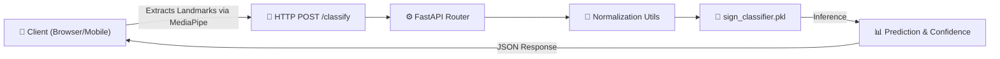

<div align="center">

  <h1>ML API</h1>

  <p><strong>FastAPI-based Machine Learning service for real-time American Sign Language (ASL) classification</strong></p>

  <p>
    Translating 21 hand landmarks extracted from MediaPipe into ASL alphabet characters <br/>
    using a trained Random Forest Classifier.
  </p>

  <br/>

  <a href="https://github.com/Pro1943/Ml-API/blob/main/LICENSE"></a>
  <a href="https://github.com/Pro1943/Ml-API/stargazers"></a>

  <br/><br/>

  <a href="#-features">Features</a>&nbsp;&nbsp;·&nbsp;&nbsp;<a href="#-api-reference">API Reference</a>&nbsp;&nbsp;·&nbsp;&nbsp;<a href="#-public-access--usage">Public Access</a>&nbsp;&nbsp;·&nbsp;&nbsp;<a href="#-model-details">Model Details</a>

</div>

<br/>

---

## 📋 Table of Contents

- [About](#-about)
- [Public Access & Usage](#-public-access--usage)
- [Features](#-features)
- [System Architecture](#-system-architecture)
- [API Reference](#-api-reference)
- [Model Details](#-model-details)
- [Local Development](#-local-development)
- [Project Structure](#-project-structure)
- [License](#-license)

---

## 💡 About

**ML API** is a standalone serverless microservice designed to power the computer vision capabilities.

It exposes a lightweight, fast HTTP endpoint that accepts normalized 3D hand landmarks (typically generated by Google's MediaPipe on a client device) and returns the most probable ASL letter (A-Z) along with a confidence score.

---

## 🌍 Public Access & Usage

This API is **publicly available** for anyone to use in their own accessibility projects, hackathons, or research!

### How to get access:
To use the hosted public endpoint, please send a quick email to:
📧 **pro194.235@gmail.com**

*Please include a brief description of what you're building. There are no strict rate limits currently, but emailing helps me monitor usage and keep the servers running smoothly for everyone. Please try to maintain a healthy conversation.*

---

## ✨ Features

| Feature | Description |
|:--------|:------------|
| ⚡ **Lightning Fast** | Optimized FastAPI serverless deployment with < 50ms inference time |
| 🌲 **Random Forest Model** | 100-tree Scikit-Learn ensemble model for robust classification |
| 📐 **Auto-Normalization** | Built-in coordinate normalization for distance and scale invariance |
| 🛡️ **Cross-Origin Ready** | Configured CORS for easy integration into web frontends |
| 📦 **Portable** | Self-contained Python inference pipeline, easy to deploy anywhere |

---

## 🏗️ System Architecture



---

## 📡 API Reference

### `POST /classify`

Classifies a set of 21 3D hand landmarks into an ASL character.

**Headers:**
- `Content-Type: application/json`

**Request Body Schema:**
```json
{
  "landmarks": [
    { "x": 0.52, "y": 0.71, "z": -0.03 },
    { "x": 0.49, "y": 0.65, "z": -0.01 },
    ... // Exactly 21 landmark objects required
  ]
}
```

**Success Response (200 OK):**
```json
{
  "sign": "A",
  "confidence": 0.94
}
```

### `GET /`

Health check endpoint to verify the service is running.

**Success Response (200 OK):**
```json
{
  "status": "ok",
  "message": "ML Classifier API is running"
}
```

---

## 🧠 Model Details

- **Algorithm:** Random Forest Classifier (`scikit-learn`)
- **Estimators:** 100 trees
- **Input Features:** 63 dimensions (21 landmarks × 3 coordinates [x,y,z])
- **Preprocessing:** Translation to wrist origin (0,0,0) and scale normalization by maximum distance.
- **Classes:** A-Z (Note: Dynamic signs like 'J' and 'Z' may have lower accuracy as they rely on single-frame static heuristics).
- **Training Data:** Sourced from the Kaggle ASL image dataset, processed through MediaPipe Hand Landmarker.

---

## 🚀 Local Development

If you'd like to run the API locally or train your own model:

### Prerequisites
- Python 3.9+
- pip

### Setup
```bash
# Clone the repository
git clone https://github.com/Pro1943/Ml-API.git
cd Ml-API

# Install dependencies
pip install -r requirements-dev.txt
```

### Run Inference Server
```bash
uvicorn main:app --reload --port 8000
```
The API will be available at `http://localhost:8000`. API documentation (Swagger UI) is automatically generated at `http://localhost:8000/docs`.

### Retrain the Model
If you want to build the model from scratch using your own dataset:
1. Place images in a structured directory format.
2. Run `python convert_image_to_landmarks.py` to extract CSV features.
3. Run `python train.py` to generate a new `sign_classifier.pkl`.

---

## 📄 License

This project is licensed under the **MIT License**. See the [LICENSE](./LICENSE) file for details.

---

<div align="center">
  <sub>Built for the <strong>ASI:One AI Hackathon</strong>. Maintained by <a href="https://github.com/Pro1943">Abir Saha</a>.</sub>
</div>